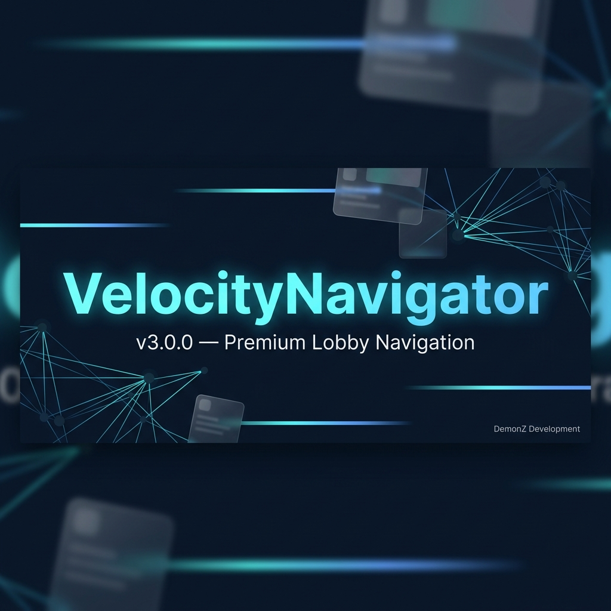
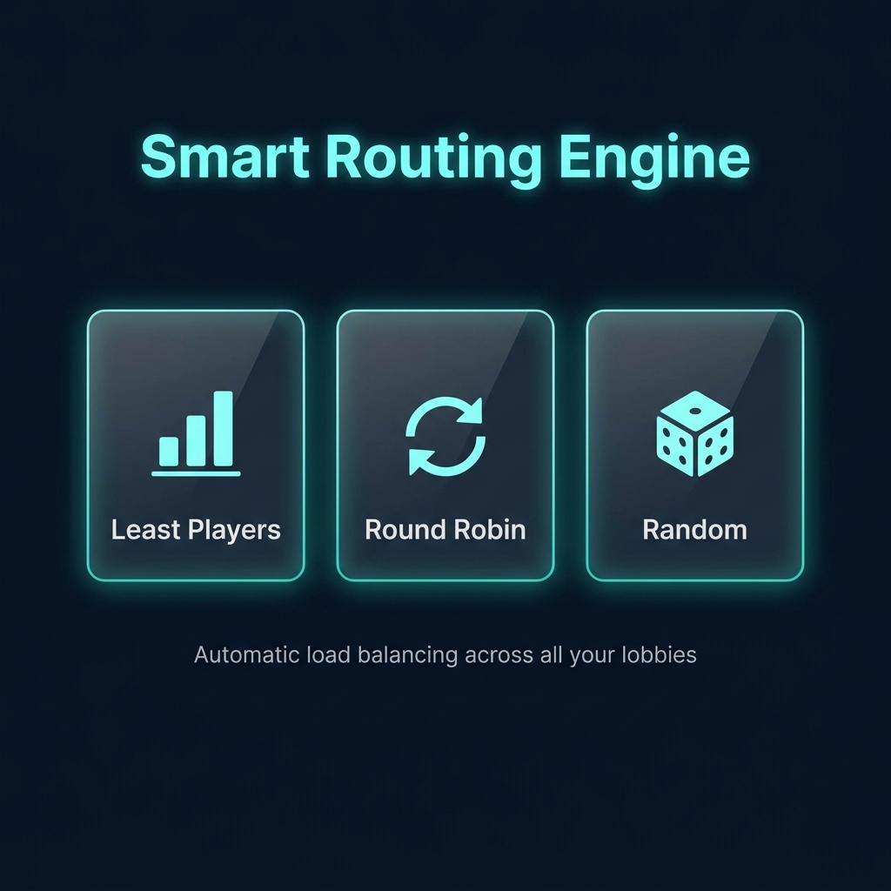

<p align="center">
  
</p>

<h1 align="center">VelocityNavigator</h1>

<p align="center">
  <strong>Premium lobby navigation and intelligent load balancing for Velocity proxies.</strong>
  <br>
  <em>Built by <a href="https://github.com/sdemonzdevelopment-spec">DemonZ Development</a></em>
</p>

<p align="center">
  
  
  
  
</p>

---

## ✨ What is VelocityNavigator?

VelocityNavigator is a premium Velocity proxy plugin that provides **intelligent lobby routing** for Minecraft networks. Instead of dumping every player onto the same server, it distributes them evenly across your lobbies using real-time load balancing.

<p align="center">
  
</p>

---

## 🚀 v3.0.0 Feature Highlights

| Feature | Description |
|---------|-------------|
| 🧠 **3 Routing Modes** | `least_players` \| `round_robin` \| `random` — choose the algorithm that fits your network |
| ⚡ **Initial Join Balancing** | Players are load-balanced the moment they connect, not just when they type `/lobby` |
| 🔀 **Contextual Routing** | Route players to game-specific lobbies based on which server they're leaving |
| 🏥 **Async Health Checks** | Ping candidate lobbies before routing with configurable timeout + caching |
| 🛡️ **Ping Coalescing** | Multiple simultaneous requests share one ping — no network storms |
| 📊 **bStats Telemetry** | Anonymous usage metrics via [bStats](https://bstats.org/plugin/velocity/Velocity%20Navigator/28341) |
| 🔄 **Auto Update Checker** | Checks Modrinth for new versions on startup |
| 🔌 **Developer API** | Third-party plugins can hook into routing via `NavigatorAPI` |
| 📖 **Self-Documenting Config** | `navigator.toml` generates with inline docs explaining every setting |
| 🛠️ **Full Admin Suite** | `/vn status`, `/vn reload`, `/vn debug` with tab-completion |

---

## 📦 Installation

1. Download `VelocityNavigator-3.0.0.jar` from [Releases](../../releases)
2. Place it in your Velocity proxy's `plugins/` folder
3. Start (or restart) the proxy
4. Edit `plugins/velocitynavigator/navigator.toml` to configure

**Requirements**: Velocity 3.x • Java 17+

---

## ⚙️ Quick Configuration

```toml
[routing]
# Available modes: "least_players", "round_robin", "random"
selection_mode = "least_players"

# Balance players when they first connect (not just /lobby)
balance_initial_join = true

# Your lobby servers (must match names in velocity.toml)
default_lobbies = ["lobby-1", "lobby-2"]
```

See the [Configuration Guide](docs/configuration-guide.md) for all settings.

---

## 🛠️ Commands

| Command | Permission | Description |
|---------|-----------|-------------|
| `/lobby` | `velocitynavigator.use` | Send to the best available lobby |
| `/hub`, `/spawn` | `velocitynavigator.use` | Aliases for `/lobby` |
| `/vn reload` | `velocitynavigator.admin` | Hot-reload navigator.toml |
| `/vn status` | `velocitynavigator.admin` | View runtime status |
| `/vn version` | `velocitynavigator.admin` | Check for updates |
| `/vn debug player <name>` | `velocitynavigator.admin` | Preview routing decision |
| `/vn debug server <name>` | `velocitynavigator.admin` | Inspect server health |


---

## 🔌 Developer API

Other Velocity plugins can integrate with VelocityNavigator:

```java
NavigatorAPI api = NavigatorAPIProvider.get();
if (api != null) {
    api.previewRoute(player).thenAccept(decision -> {
        System.out.println("Best lobby: " + decision.selectedServer());
    });
}
```

See the [Developer API Guide](docs/developer-api.md) for full documentation.

---

## 📖 Documentation

| Document | Description |
|----------|-------------|
| [Configuration Guide](docs/configuration-guide.md) | Every `navigator.toml` setting explained |
| [Routing Algorithms](docs/routing-algorithms.md) | Deep dive into the 3 routing modes |
| [Initial Join Balancing](docs/initial-join-balancing.md) | How initial connection balancing works |
| [Developer API](docs/developer-api.md) | Integrate from your own plugins |
| [Changelog](CHANGELOG.md) | Full release history |
| [Contributing](CONTRIBUTING.md) | How to contribute |

---

## 🏗️ Building from Source

```bash
git clone https://github.com/sdemonzdevelopment-spec/VelocityNavigator.git
cd VelocityNavigator
mvn clean verify
# JAR output: target/VelocityNavigator-3.0.0.jar
```

---

## 📊 Stats

[](https://bstats.org/plugin/velocity/Velocity%20Navigator/28341)

---

<p align="center">
  
  <br>
  <strong>Built with ❤️ by <a href="https://github.com/sdemonzdevelopment-spec">DemonZ Development</a></strong>
  <br>
  <em>Premium Minecraft infrastructure, engineered for scale.</em>
</p>
