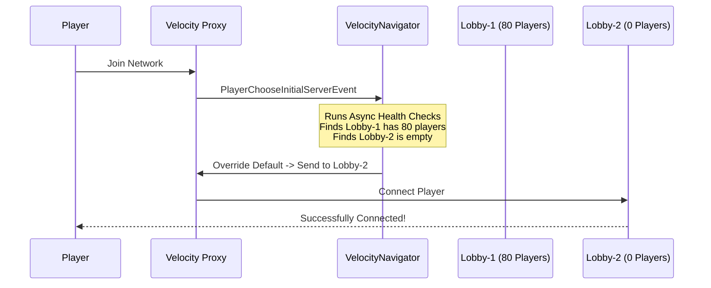

# Initial Join Balancing

> [!TIP]  
> **New in v4.0.0** *(updated in v4.1.0)* — Load-balance players the moment they connect to the proxy, bypassing the rigid configurations of vanilla Velocity!

---

## 🛑 The Vanilla Velocity Problem

By default, Velocity uses a static `try` list in `velocity.toml` to decide which server a new player joins:

```toml
[servers]
try = ["lobby-1", "lobby-2"]
```

Velocity always tries the **first server** in the list. If `lobby-1` is online, *every single player* joins `lobby-1`. The second server is only used if the first one crashes or shuts down. This means your expensive second lobby sits entirely empty while the first one bears the brunt of your entire community's weight.

---

## ⚡ The VelocityNavigator Solution

VelocityNavigator v4.1.0 intercepts the `PlayerChooseInitialServerEvent` and forcefully applies its routing brain **before** the player's client ever lands on any server.



- **`least_players` mode**: The server with the fewest players is selected.
- **`power_of_two` mode**: Two random candidates are picked; the emptier one wins.
- **`round_robin` mode**: Players alternate between lobbies in strict rotation.
- **`random` mode**: Each player gets a random lobby assignment.
- **`weighted_round_robin` mode**: Servers with higher weight receive proportionally more players.
- **`least_connections` mode**: Uses EMA of connection rates and load for bursty traffic.
- **`consistent_hash` mode**: Player UUID deterministically maps to a specific server.

---

## ⚙️ Configuration

Open your `navigator.toml`:

```toml
[routing]
balance_initial_join = true
```

| Value | Behavior |
|-------|----------|
| `true` | Players are load-balanced immediately upon initial join. |
| `false` | Velocity's native `try` list is used (default Velocity fallback). |

---

> [!WARNING]  
> You might want to temporarily set `balance_initial_join = false` if you have a dedicated "Welcome/Auth" server that *all* unverified players must join first unconditionally.

---

## 🔬 Technical Details

- Subscribes to `PlayerChooseInitialServerEvent` (fires immediately after `PostLoginEvent`).
- The routing ping-health tests run concurrently to prevent artificial sign-in latency.
- When `verbose_logging = true`, every balanced initial join is debug-logged.
