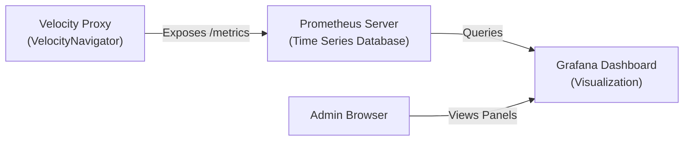

# Prometheus & Grafana Integration Setup Guide

This guide walks you through setting up metrics collection for **VelocityNavigator** using **Prometheus** to gather real-time data and **Grafana** to visualize it on a beautiful, interactive dashboard.

---

## Architecture Overview



* **VelocityNavigator** exposes statistics (active players, server states, circuit breaker statuses, connection rates) in a format Prometheus understands.
* **Prometheus** visits your proxy periodically to collect these statistics.
* **Grafana** reads from Prometheus to generate visual charts and timelines.

---

## Step 1: Enable Metrics in VelocityNavigator

Open your `navigator.toml` file and look for the `[metrics]` block. Configure it as follows:

```toml
[metrics]
enabled = true

[metrics.prometheus]
enabled = true
bind_host = "0.0.0.0"       # Use 0.0.0.0 to listen on all interfaces
port = 9225                 # Choose a free port (e.g. 9225 or 30042)
bearer_token = ""           # Optional: add a token to protect metrics (e.g. "my-secret-token")
```

> [!IMPORTANT]
> **Pterodactyl & Game Panel Users:** 
> Docker container environments block non-allocated ports. To use the Prometheus exporter, you **must**:
> 1. Request an extra **Port Allocation** (e.g., `25582`) in your panel under the **Network** tab.
> 2. Set `port = 25582` in your `navigator.toml` to match that exact allocated port.

After updating the config, restart your proxy or reload the config using `/vn reload`.

---

## Step 2: Configure Prometheus

If you are running your own Prometheus instance (either on the same VPS, docker host, or a central metrics server), add your Velocity proxy as a scrape target in your `prometheus.yml` configuration:

```yaml
scrape_configs:
  - job_name: 'velocity_navigator'
    scrape_interval: 5s       # Scraping frequency
    metrics_path: '/metrics'  # Default path
    static_configs:
      - targets: ['<PROXY_IP>:<METRICS_PORT>'] # E.g., '13.126.225.90:9225'
```

### Securing Your Metrics (Highly Recommended)
If you set a `bearer_token` in your `navigator.toml`, you must tell Prometheus to pass that token when scraping:

```yaml
scrape_configs:
  - job_name: 'velocity_navigator'
    scrape_interval: 5s
    metrics_path: '/metrics'
    authorization:
      credentials: 'your-secret-token' # Replace with your actual bearer_token
    static_configs:
      - targets: ['<PROXY_IP>:<METRICS_PORT>']
```

Restart Prometheus to apply the configuration.

---

## Step 3: Set Up Grafana

### 1. Add Prometheus Data Source
1. Open your Grafana dashboard in your browser (usually `http://<vps-ip>:3000`).
2. Navigate to **Connections** -> **Data Sources** -> **Add data source**.
3. Select **Prometheus**.
4. In the **Connection** settings, enter your Prometheus server URL (e.g. `http://localhost:9090`).
5. Scroll to the bottom and click **Save & test**.

### 2. Generate and Import the Dashboard
Run this command on your Velocity proxy console to generate the pre-built dashboard JSON configuration file:

```
vn setup grafana
```

This will write a file named `grafana-dashboard.json` into your `plugins/VelocityNavigator` folder.

#### **Importing the JSON:**
1. Download `grafana-dashboard.json` from your proxy server files to your computer.
2. In the Grafana web panel, click **Dashboards** in the left menu.
3. Click the **New** dropdown button in the top right and select **Import**.
4. Click **Upload JSON file** and select the `grafana-dashboard.json` file (or paste the JSON from the [Troubleshooting Guide](Troubleshooting-Guide#example-grafana-dashboard-json) in the raw text box).
5. Select your Prometheus data source at the bottom and click **Import**.

---

## Key Metrics Exposed

Here are the key metrics you can use to build custom charts:

| Metric Name | Type | Description |
|:---|:---|:---|
| `velocitynavigator_player_joins_total` | Counter | Total player connection attempts to the proxy. |
| `velocitynavigator_player_leaves_total` | Counter | Total player disconnects. |
| `velocitynavigator_server_online` | Gauge | Online state of tracked backend servers (`1` = Online, `0` = Offline). |
| `velocitynavigator_server_players` | Gauge | Player count currently connected to each backend server. |
| `velocitynavigator_server_latency_ms` | Gauge | Latency/Ping of health checks to backend servers (ms). |
| `velocitynavigator_server_circuit_breaker` | Gauge | State of each circuit breaker (`0`=CLOSED, `1`=HALF_OPEN, `2`=OPEN). |
| `velocitynavigator_server_drained` | Gauge | Drained state of backend servers (`1`=Drained, `0`=Active). |
| `velocitynavigator_routed_connections_total` | Counter | Total successful connections routed to each server. |
| `velocitynavigator_redirects_total` | Counter | Total count of redirects grouped by reason. |

---

## 🔧 Troubleshooting Setup Issues

* **Failed to bind to port:** Check if another service is using the port, or change it in `navigator.toml`.
* **Cannot assign requested address:** If you are hosted on Pterodactyl or container networks, set `bind_host` to `0.0.0.0` instead of a public IP.
* **Connection Timed Out:** Make sure you have opened your metrics port (e.g. `9225` or `30042`) in your cloud provider's firewall (like AWS Lightsail, DigitalOcean, or panel firewall).

For detailed steps, see the [Troubleshooting Guide](Troubleshooting-Guide).
